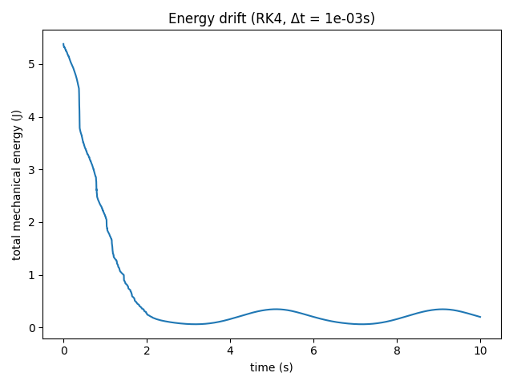
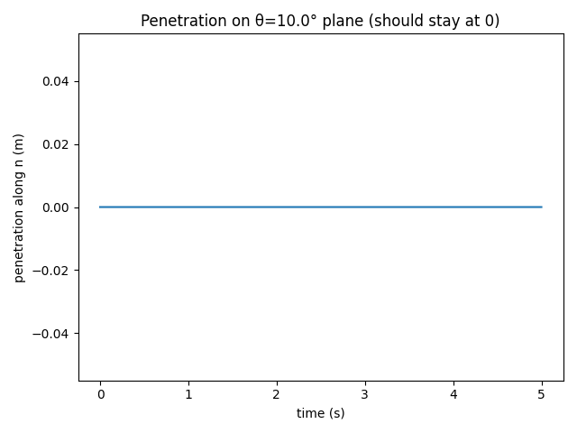

# Midterm Miniproject: Tensegrity Rolling Robot (CSE 291 – SP25)

This repository contains a **node-based tensegrity rolling robot** simulation written in Python.  
The system’s equations of motion are derived from the **Principle of Least Action**, augmented with a soft penalty for ground contact and optional friction.  
A 3D animation (if matplotlib is installed) demonstrates the robot rolling on an inclined plane, driven by simple cable/rod actuation.

## Table of Contents

- [Overview](#overview)
- [Features and Highlights](#features-and-highlights)
- [Project Structure](#project-structure)
- [Installation and Setup](#installation-and-setup)
- [Execution Instructions](#execution-instructions)
- [Simulation Parameters](#simulation-parameters)
- [References and Resources](#references-and-resources)
- [Contact](#contact)
 
## Overview

In this project, we simulate a **six-strut tensegrity robot** in 3D space. Each strut is modeled as a high-stiffness spring with adjustable rest length (for actuation), and the tensional cables are modeled similarly but only resist extension. The approach:

1. **Least-Action Principle**:  
   - Formulate the Lagrangian \( L = K - U \) from node-based kinetic energy and potential energy.  
   - Apply the Euler–Lagrange equations to derive the motion.  
   - Add constraints (penalty-based) to prevent ground penetration.

2. **Explicit Time Integration**:  
   - Uses a classic **4th-order Runge–Kutta (RK4)** approach.  
   - Incorporates friction and damping as extra (non-conservative) forces.

3. **Collision Handling**:  
   - A penalty potential pushes nodes back whenever they cross the plane.  
   - Friction is implemented with a static/kinetic threshold approach.

These simulations were developed by **Param Somane** for CSE 291 (Spring 2025).  
A short video (`tensegrity_rolling_robot.mp4`) is included under `animation/`.

https://github.com/user-attachments/assets/01ca03e2-035d-43b6-a04a-ce971644fd4a
 
## Features and Highlights

- **Node-Based Tensegrity Dynamics**: 12 nodes with 6 struts and multiple cables.  
- **Soft Contact Modeling**: Ground collisions prevented by a penalty-based force.  
- **Friction**: Static/kinetic friction with user-set friction coefficients.  
- **RK4 Numerical Integrator**: Stable and straightforward explicit solver.  
- **Inclined Plane**: Plane orientation can be changed via command-line arguments (angle).  
- **Optional Visualization**: 3D animation in Python via `matplotlib` (if available).
 
## Project Structure

```plaintext
├── animation
│   └── tensegrity_rolling_robot.mp4  # Example animation/video clip
├── archive                           # Misc. data, older logs, etc.
├── tex
│   ├── default-0.5s.png              # Figure from early animation frame
│   ├── default-8.0s.png              # Figure from later animation frame
│   ├── icosahedron_diagram.jpg       # Diagram of the six-strut structure
│   ├── Midterm_Project_Report.pdf    # Project report in PDF format
│   └── report.pdf                    # LaTeX document with derivation & explanation
├── README.md                         # This README file
├── energy_plot.py                    # energy‑drift validation
├── friction_test.py                  # static/kinetic friction sanity check
└── tensegrity_robot.py               # Main Python script
```

- **tensegrity_robot.py**: Main script that implements the tensegrity robot class, the contact & friction model, and the RK4 integrator.  
- **tex/**: Contains LaTeX source and some static images for the written report.  
- **animation/**: Contains a sample MP4 demonstrating the rolling tensegrity robot.  
- **archive/**: Can hold experimental data, older scripts, or unused assets.
 
## Installation and Setup

### Prerequisites

- **Python 3.7+** (tested on Python 3.10).
- **NumPy** for array operations.
- **Matplotlib** (optional) for 3D visualization; if not installed or `--no-visual` is passed, simulation runs headless.
- **FFmpeg** (optional) if you want to save a video of the animation in `.mp4` format.

### Recommended Steps

1. **Clone** or **Download** this repository.
2. **Create a virtual environment**:
   ```bash
   python -m venv venv
   source venv/bin/activate  # or .\venv\Scripts\activate on Windows
   ```
3. **Install Requirements**:
   Install `numpy` and `matplotlib` manually.
 
## Execution Instructions

1. **Run with 3D Visualization**:
   ```bash
   python tensegrity_robot.py
   ```
   A live animation will open in a Matplotlib 3D window, showing the icosahedron-like tensegrity rolling on a plane.

2. **Customize Settings** (e.g., angle of plane, total sim time, or output video):
   ```bash
   python tensegrity_robot.py --drop 2.2 --angle -10 --save "rolling_demo.mp4"
   ```
   - `--drop 2.2`: sets the drop height to 2.2 m.
   - `--angle -10`: sets the ground plane incline to 10°.  
   - `--save "rolling_demo.mp4"`: saves a video of the 3D animation.

See `python tensegrity_robot.py --help` for all available CLI flags.
 
## Simulation Parameters

Inside `tensegrity_robot.py`, the primary constants are:

- **Mass per Node** (`MASS_NODE`): `0.05 kg` by default.
- **Gravity** (`g`): `9.81 m/s^2`.
- **Rod Stiffness** (`K_ROD`): `1e5`.
- **Cable Stiffness** (`K_CABLE`): `1e4`.
- **Ground Contact Stiffness** (`K_GROUND`): `1e5`.
- **Friction Coefficients** (`MU_STATIC`, `MU_KINETIC`): both set to `0.8`.
- **Integration Timestep** (`DT`): `1e-3 s` in an RK4 scheme.
- **Plane Inclination** (`--angle`): default is `2.0°`.
- **Drop Height**: default is `0.5 m` above the plane.
- **Actuation**: By default, 20% of cables are randomly chosen to be “actuated,” but you can alter logic for custom actions or GA-based optimization.

You can freely modify these constants or pass corresponding command-line arguments.
 
## Validation

| Test script | What it verifies | Expected plot |
|-------------|------------------|---------------|
| `python energy_plot.py` | Total mechanical energy with RK4 &nbsp;(\$\Delta t = 10^{-3}\$ s) remains bounded once transient vibrations decay. |  |
| `python friction_test.py` | Static → kinetic Coulomb switch and ground‐penetration penalty. A zero line means no penetration. |  |

These quick checks give confidence that the integrator is stable for the
chosen stiffness/time‑step pair and that the friction/contact logic is
physically sound.

## References and Resources

1. **Skelton R.E. & de Oliveira M.C.**  
   *Tensegrity Systems.* Springer, 2014.  
2. **Zha J. et al.**  
   *Design and Control of a Collision-Resilient Aerial Vehicle With an Icosahedron Tensegrity Structure,* IEEE/ASME T-Mech, 2024.  
3. **Hirai & Imuta (2014)**  
   *Dynamic Modeling of Tensegrity Robots Rolling over the Ground,* ICCM.  
4. **Tensegrity Shape/Locomotion Control**  
   - Cai H. et al., *A General Model for Both Shape Control and Locomotion Control of Tensegrity Systems*, 2020.  
5. **Runge-Kutta ODE Integration**  
   - Hairer E., Nørsett S.P., Wanner G., *Solving Ordinary Differential Equations I*, 2nd ed., Springer, 2009.  
 
## Contact

For questions, feedback, or collaboration inquiries regarding this tensegrity project:

**Param Somane**  
Email: [psomane@ucsd.edu](mailto:psomane@ucsd.edu)  
*CSE 291 (Spring 2025) Midterm Miniproject*  
University of California, San Diego
